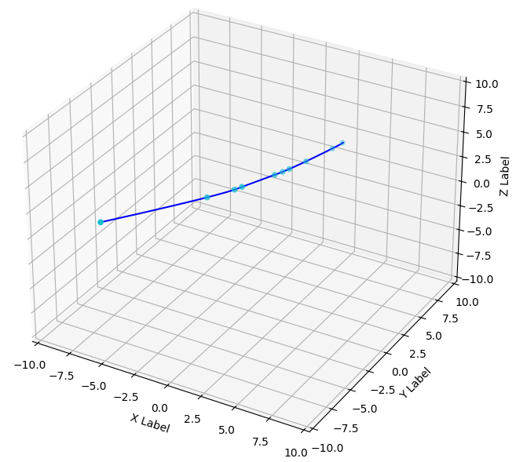

# - 粒子群三维空间路径规划-初始版本
This project aims to explore and implement the Particle Swarm Optimization (PSO) algorithm in the field of 3D space path planning. PSO is a swarm intelligence algorithm that simulates social behavior, and its principle is based on mimicking the behavior of groups such as flocks of birds or schools of fish to solve optimization problems. In 3D space path planning, PSO is utilized to find the optimal path from a starting point to a destination, taking into account factors such as obstacle avoidance, shortest path length, and path smoothness.

Project Overview

Objective: To efficiently and accurately plan paths from a starting point to a destination in 3D space using the PSO algorithm.
Application Areas: Unmanned aerial vehicle (UAV) route planning, autonomous vehicle navigation systems, robot path planning, etc.
Core Challenge: To find the optimal or near-optimal path while considering various practical constraints, such as obstacles and path smoothness.
Features

Swarm Intelligence: Utilizing the collective wisdom of a particle swarm, simulating the social cooperation behavior of organisms in nature.
Efficient Algorithm: The PSO algorithm is simple in structure, with few parameters, easy to implement, and suitable for solving complex optimization problems.
Applicability: Capable of being applied in various 3D environments, including but not limited to urban settings, mountainous terrains, etc.
Implementation Details

Particle Representation: Each particle represents a potential path, encoded by its position and velocity.
Fitness Function: A fitness evaluation mechanism is defined to assess the quality of paths.
Iterative Optimization: Through continuous iterations, particles adjust their paths based on individual and collective experiences, gradually converging to the optimal solution.

本项目旨在探索并实现粒子群优化算法（Particle Swarm Optimization, PSO）在三维空间路径规划领域的应用。PSO是一种模拟社会行为的群体智能算法，它的基本原理是通过模拟鸟群、鱼群等群体的行为来处理优化问题。在三维空间路径规划问题中，PSO被用于寻找从起点到终点的最优路径，同时考虑到避障、最短路径长度、路径平滑性等因素。
项目概述
目标：利用PSO算法在三维空间中高效、准确地规划出从起点到终点的路径。
应用领域：无人机航线规划、自动驾驶汽车导航系统、机器人路径规划等。
核心挑战：如何在考虑各种实际约束（如障碍物、路径平滑性）的同时，找到最优或近似最优的路径。

特性
群体智能：利用粒子群体的集体智慧，模拟自然界生物的社会协作行为。
高效算法：PSO算法结构简单，参数少，易于实现，适合解决复杂的优化问题。
适用性：能够适用于各种三维空间的环境，包括但不限于城市环境、山地地形等。

实现细节
粒子表示：每个粒子代表一条可能的路径，通过其位置和速度进行编码。
适应度函数：定义一种适应度评估机制，用于评价路径的优劣。
迭代优化：通过不断迭代，粒子根据个体和群体经验调整自己的路径，逐渐趋向于最优解。

