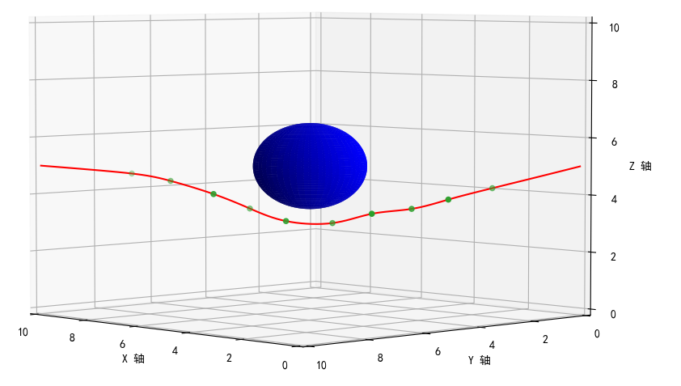

# - Particle Swarm Optimization for 3D Space Obstacle Avoidance Path Planning - Initial Version.
This project aims to explore and implement the Particle Swarm Optimization (PSO) algorithm in the field of 3D space obstacle avoidance path planning. PSO is a swarm intelligence algorithm that simulates social behavior, and its principle is based on mimicking the behavior of groups such as flocks of birds or schools of fish to solve optimization problems. In 3D space path planning, PSO is utilized to find the optimal path from a starting point to a destination, taking into account factors such as obstacle avoidance, shortest path length, and path smoothness.

Project Overview

Objective: To efficiently and accurately plan paths from a starting point to a destination in 3D space using the PSO algorithm.
Application Areas: Unmanned aerial vehicle (UAV) route planning, autonomous vehicle navigation systems, robot path planning, etc.
Core Challenge: To find the optimal or near-optimal path while considering various practical constraints, such as obstacles and path smoothness.

Features

Swarm Intelligence: Utilizing the collective wisdom of a particle swarm, simulating the social cooperation behavior of organisms in nature.
Efficient Algorithm: The PSO algorithm is simple in structure, with few parameters, easy to implement, and suitable for solving complex optimization problems.
Applicability: Capable of being applied in various 3D environments, including but not limited to urban settings, mountainous terrains, etc.

Implementation Details

Particle Representation: Each particle represents a potential path, encoded by its position and velocity.
Fitness Function: A fitness evaluation mechanism is defined to assess the quality of paths.
Iterative Optimization: Through continuous iterations, particles adjust their paths based on individual and collective experiences, gradually converging to the optimal solution.

